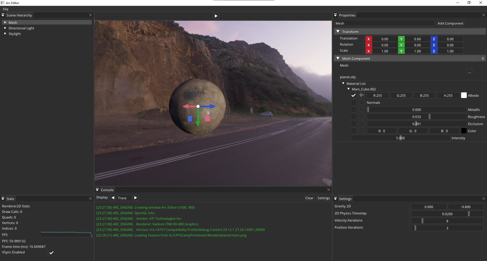
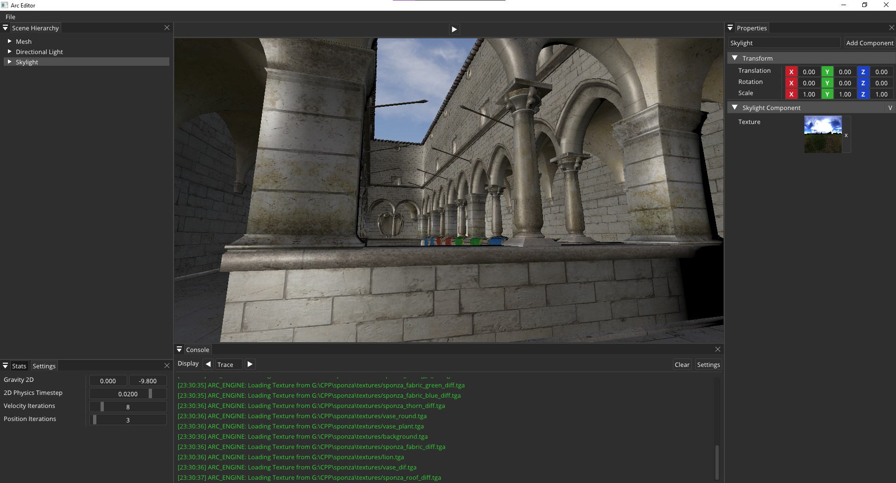

<h1 align="center" style="border-bottom: none;">
  <a href="https://github.com/MohitSethi99/ArcEngine/">Arc Game Engine</a>
</h1>

<p align="center">
  <a href=""></a>
  
  <a href=""></a>
  <br/>
</p>

## About

Arc is an in-development game engine written in C++, allowing an ECS approach and C# scripting (In Active Development).

I develop it in my spare time as a personal project, so expect frequent periods of time with no activity in this repository.

<p align="center">
    
</p>


## Set up

You can clone Arc Game Engine using git. Make sure you do a ```--recursive``` clone!

```git clone --recursive https://github.com/MohitSethi99/ArcEngine.git```

Arc Game Engine is built in a Windows environment, using Visual Studio 2019. 

Execute the script `scripts/Win-GenProjects.bat` 
to generate the solution and project files.

## Current Features

Right now, Arc Game Engine is very bare-bones. Its most remarkable features are:

| Feature | Description | Status |
| ------- | ----------- | ------ |
| **Scene system** | Scene-based entity management. Scene serialization with YAML. | Done✔️ |
| **ECS support** | Entity Component System approach through *entt*. | Done✔️ |
| **2D Physics** | Basic 2D Physics using Box2D | Done✔️ |
| **2D Renderer** | 2D batch renderer supporting OpenGL. | Done✔️ |
| **3D Renderer** | Basic 3D renderer with lighting, IBL and PBR workflow (not fully supported PBR for now) supporting OpenGL. Shadows are not supported for now. | Done✔️ |
| **ImGui support** | Basic game editor and in-game debug UI using ImGui. | Done✔️ |

## Planned Features

| Feature | Description | Status |
| ------- | ----------- | ------ |
| **Shadow Support** | Basic scripting in C# using mono. | WIP 💻 |
| **Shadow Support** | Soft and Hard shadow support in OpenGL 3D Renderer. | WIP 💻 |
| **Asset manager** | Basic asset handling API. | WIP 💻 |
| **3D Physics system** | Nvidia's Physx engine support for 3D physics. | TODO 📋 |
| **Audio system** | Sound API. | TODO 📋 |
| **Font support** | Extend the Renderer capabilities so it can draw text. | TODO 📋 |
| **Direct3D and Vulkan support** | Extend the Renderer to support D3D and Vulkan. | TODO 📋 |

The game editor is in continuous development.

<p align="center">
    
</p>


## Dependencies

Arc Game Engine has the following dependencies:

  - [ImGui](https://github.com/ocornut/imgui) for GUI rendering.
  - [GLFW](https://github.com/glfw/glfw) for OpenGL, OpenGL ES, window creation 
  and input handling. More info at its [website](https://www.glfw.org/).
  - [Glad](https://glad.dav1d.de) for OpenGL rendering.
  - [glm](https://github.com/g-truc//glm) as math(s) library.
  - [entt](https://github.com/skypjack/entt) for ECS management.
  - [spdlog](https://github.com/gabime/spdlog) for logging.
  - [stb_image.h](https://github.com/nothings/stb) for loading textures.
  - [assimp](https://github.com/assimp/assimp) for loading meshes.
  - [box2d](https://github.com/erincatto/box2d.git) for 2D physics.
  - [ImGuizmo](https://github.com/CedricGuillemet/ImGuizmo) for in editor transformation gizmos.
  - [yaml-cpp](https://github.com/jbeder/yaml-cpp) for scene serialization in YAML.

Projects are generated with [Premake 5](https://github.com/premake/premake-core/releases).

## Special Mentions

Huge shout out to:

  - Yan Chernikov's [video series](https://www.youtube.com/playlist?list=PLlrATfBNZ98dC-V-N3m0Go4deliWHPFwT). Original code at [TheCherno/Hazel](https://github.com/TheCherno/Hazel).
  - LearnOpenGL [OpenGL tutorials](https://learnopengl.com).
  - Jason Gregory's [Game Engine Architecture](https://www.gameenginebook.com) book.
  